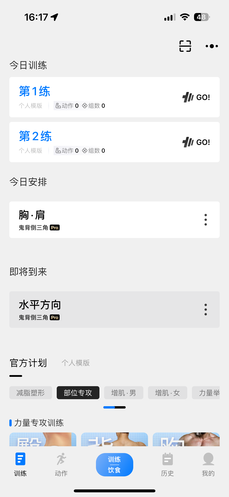
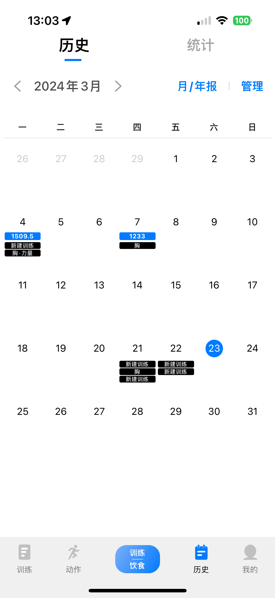
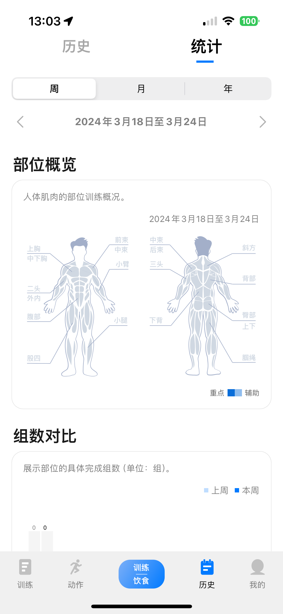
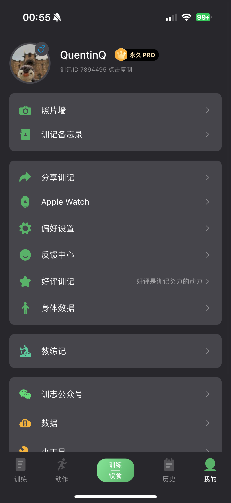
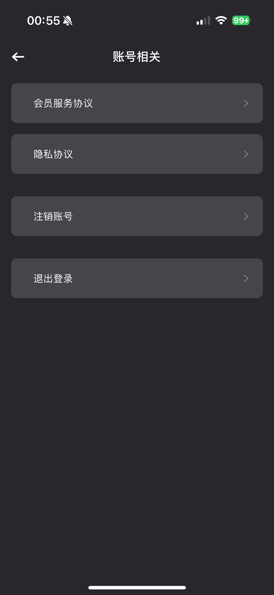

https://www.figma.com/community/file/1345335852353749746/eduowel-online-learning-app-mobile-ui-kit
UI风格参考

# Step 1

| Quension           | Answer  |
| ------------------ | ------- |
| Application domain | fitness |
| Use and purpose | XXX |
| User group | people who fitness in gym |
| the scope and limitations | 年龄,以及群体的活动范围爱好范围等,比如说限制于在健身房的人群或者热爱健身的人 |

# Step 2

## Key Screen
### 1. Log in / Sign up

- 打开app首先出现的页面, 登录或注册, 以及同意隐私整层等协议文档
- 登录需要支持Google授权登录

### 2. Home

**导航栏第一个Button**

主要显示训练计划(今日计划) 以及今日饮食摄入

### 3. Course/Plan

**导航栏第二个Button**

主要展示一些训练计划以及自定义训练计划

### 4. 新建训练/饮食

**导航栏中央Button** 

点击后是有一个半透明带scrim的Box组件实现, Box组件中带上BottomNavifationView组件

两个Button按钮, 一个是新建训练, 一个是新建饮食

### 5. 训练统计/训练历史

**导航栏第三个Button**

顶部有两个Button(1为日历, 2为统计)

### 6. My profile/ Me

**导航栏第四个Button**

登录的情况下是个人信息页面

| component | des |
| --------- | --- |
| CardView 1 头像照片 | 圆框头像照片 |
| CardView 1 用户名 | 展示用户名, 在头像边 | 
| CardView 1 用户ID | 在用户名下, 小字体展示 |
| CardView 2 身体数据 | 类似身高体重, 运动情况的数据, 做成单独的Card组件, 然后点击可以跳转到细节,进行查看和编辑 |
| CardVIew 3 偏好设置 | 点击跳转单独页面 |
| CardVIew 3 Help & Feedback | XXX |
| CardVIew 3 About Do | XXX |

#### 6.1 头像照片/用户名点击之后的页面

#### 6.2 身体数据页面

#### 6.3 偏好设置跳转的页面
| 组件 | des |
| --------- | ---------- |
| About Do | 该行Row组件点击会跳转到另一个页面 |

##### 6.3.1 About Do 点击跳转的页面
包含title和多行Row组件
| Row | Des |
| -- |--|
| 隐私协议 | XX |
| 个人信息收集清单 | XX |
| 第三方信息共享清单 | XX|
| 运动风险须知 | XX |
| 软件logo和版本号 | XX |

### 6.4 

# Reference

Calendar Library
https://github.com/boguszpawlowski/ComposeCalendar

desugar_jdk_libs
https://maven.google.com/web/index.html?q=desugar_jdk_libs#com.android.tools:desugar_jdk_libs